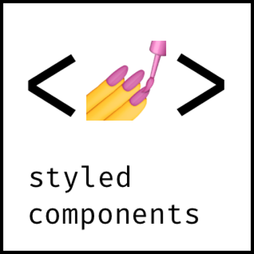

<p align="center">
  
</p>

<hr/>

## O projeto
O payflow se resume a uma plataforma para organizar boletos. Nela é possível armazenar e obter um histórico dos boletos pagos, em forma de extrato.

## Funcionalidades
- Armazenar boletos
- Escanear boletos
- Alternar entre tema claro/escuro
- Fazer login com o Google
- Trocar de conta
- Instalar aplicativo (PWA)

## Tecnologias principais

<p align="center">
  <a href="https://www.mongodb.com/pt-br">
    
  </a>
  <a href="https://nextjs.org/">
    
  </a>
  <a href="https://web.dev/progressive-web-apps/">
    
  </a>
  <a href="https://pt-br.reactjs.org/">
    
  </a>
  <a href="https://styled-components.com/">
    
  </a>
</p>


## Como executar
Clone o projeto e acesse a pasta do mesmo.
```
$ git clone https://github.com/Jonatan966/payflow
$ cd payflow
```
Crie um arquivo `.env.local` e o preencha com essas variáveis
```env
NODE_ENV=dev

# URL da aplicação
NEXTAUTH_URL=http://localhost:3000

# Para conseguir essas credenciais, é necessário acessar o Console do Google e configurar um provedor de login OAuth2
GOOGLE_PROVIDER_ID
GOOGLE_PROVIDER_SECRET=

#URL de conexão com o MongoDB
MONGODB_URI= 

#Nome do banco de dados
MONGODB_DB=payflow
```

Para iniciá-lo, siga os passos abaixo:
```
# Instalar as dependências
$ yarn

# Iniciar o projeto
$ yarn dev
```

## Licença
Este projeto está sob a licença MIT. Veja o arquivo [LICENSE](./LICENSE) para mais detalhes.
